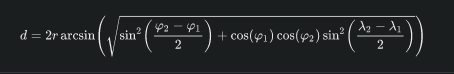

# rtos-gps
Final Work of the RTOS discipline: Develop an embedded software (server) and a client composed of at least: 4 threads, use of mutex and condition variables, implementation of 5 commands, and GPS.

### Mutextes (Para que eu não me esqueça)  
- Na leitura e escrita do arquivo (line number, não está implementado na função então, criar uma "cópia local" antes de passar o argumento)
- escrita em GPS_DATA

### Sincronização
- GPS_DATA
- 4 timers
  - gps_timer = 34
  - blocker_tracker_timer = 35
  - tolerance_timer(countdown) = 36
  - reduce_timer() = 37

### Haversine
φ = Latitudes
ƛ = Longitudes
